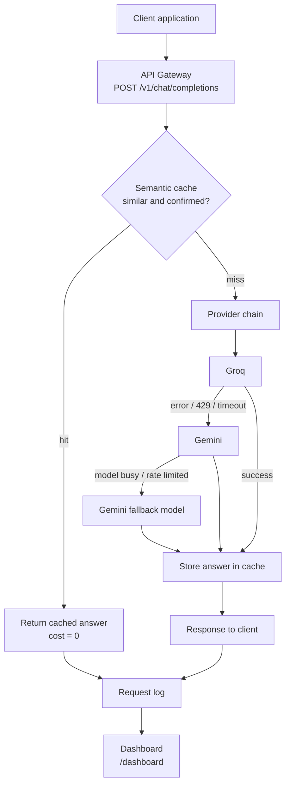

# CortexGate

**An AI gateway and cost-optimization platform for LLM applications.**

CortexGate is a self-hosted gateway that sits between an application and multiple Large Language Model (LLM) providers. The application talks to one OpenAI-compatible endpoint, and CortexGate applies a control plane to every request: semantic caching, provider failover, and cost tracking.

> **Status: mid-term prototype (updated Oct 6, 2026).** The gateway, Groq-to-Gemini failover, semantic cache, request history, and live dashboard are implemented. Gemini retries an overloaded/rate-limited chat model once using a configurable fallback model. Automated gateway tests run with `npm test`; features marked *Planned* below are not yet built. See [PROGRESS_LOG.md](PROGRESS_LOG.md) for the chronological project record.

*Major Project (PR1107), Institute of Engineering and Technology (IET), JK Lakshmipat University.*

## Why CortexGate

Applications that call LLM APIs run into three recurring problems:

1. **Rising token costs.** The same question, asked in different words, is billed in full every time because exact-match caching cannot detect rewordings.
2. **Poor load handling.** One API key on one provider returns HTTP 429 or times out under load, and the application shows the user a hard error.
3. **No visibility or control.** Teams cannot see what was spent, by which feature, or which provider is degraded.

CortexGate addresses these by inserting a gateway between the application and the providers, so routing, caching, failover and cost accounting are done once, in one place.

## Features

| Feature | Status |
|---|---|
| OpenAI-compatible endpoint (`/v1/chat/completions`) | Implemented |
| Provider adapters: Groq, Gemini | Implemented |
| Automatic failover on 5xx, 429 and timeout | Implemented |
| Semantic cache (embeddings + cosine similarity, saved to disk) | Implemented |
| Match verification (a model confirms borderline cache matches against the stored answer) | Implemented |
| Circuit breaker (skips an unhealthy provider for a short time) | Implemented |
| Live `.env` reload and persistent request history | Implemented |
| Per-request cost calculation and savings tracking | Implemented |
| Live dashboard (polling) with hit rate, tokens and cost saved, recent requests | Implemented |
| MongoDB request logging with actual vs counterfactual cost | Implemented |
| Vector database for the cache (Qdrant / pgvector) | Planned |
| Token-bucket rate limiting with priority queue (Redis, BullMQ) | Planned |
| Model cascading with quality verification and escalation | Planned |
| Free-tier-aware quota scheduler | Planned |
| React + WebSocket dashboard, budgets and alerts | Planned |

## How it works



1. The gateway embeds the prompt with the Gemini embedding API.
2. It compares the embedding with cached prompts using cosine similarity. Matches at or above the trust level (0.985) are returned directly. Borderline matches (0.88 to 0.985) are first confirmed by a quick model check against the stored answer. A confirmed match is returned with no provider call and the avoided cost is recorded.
3. On a miss, the request goes to the first provider in the chain. If that provider fails with a retryable error, the next provider is tried automatically.
4. Successful answers are stored in the cache, and every request is written to the request log that feeds the dashboard.

## Tech stack

- **Runtime:** Node.js (18+), Express
- **LLM providers:** Groq, Google Gemini (REST APIs, free tiers)
- **Embeddings:** Gemini embedding API (`gemini-embedding-001`, task type `SEMANTIC_SIMILARITY`)
- **Cache store:** in-memory vector list (Qdrant / pgvector planned)
- **Dashboard:** plain HTML + JavaScript, polling
- **Persistence:** local JSON history and optional MongoDB request logging
- **Planned:** Redis, BullMQ, Qdrant/pgvector, React + WebSocket dashboard

## Project structure

```
CortexGate/
├── README.md
├── PROGRESS_LOG.md
└── services/gateway/
    ├── package.json
    ├── .env.example
    ├── test/                       # provider failover and Gemini fallback tests
    ├── public/
    │   └── dashboard.html          # live dashboard
    ├── scripts/
    │   └── tune-threshold.mjs      # similarity threshold evaluation
    └── src/
        ├── index.js                # Express app, /health, /dashboard
        ├── routes/chat.js          # completions route, cache + failover logic
        ├── providers/              # groq.js, gemini.js, index.js (provider chain)
        ├── gateway/                # dispatch.js (failover), circuitBreaker.js, envWatcher.js
        ├── cache/                  # embedder.js, semanticCache.js, verifier.js
        └── stats/                  # requestLog.js, persist.js (saved to data/)
```

**Main files:** `src/index.js` starts the gateway; `src/routes/chat.js` handles chat requests and cache integration; `src/gateway/dispatch.js` applies provider ordering, retries, and failover; `src/providers/groq.js` and `src/providers/gemini.js` call provider APIs; `src/cache/semanticCache.js` and `src/cache/embedder.js` implement semantic caching; `src/stats/requestLog.js` and `src/stats/mongoLogger.js` record request history. `test/dispatch.test.js` and `test/gemini.test.js` cover failover behavior.

## Getting started

### Prerequisites

- Node.js 18 or newer
- A free Groq API key: https://console.groq.com/keys
- A free Gemini API key: https://aistudio.google.com/apikey

### Install and run

```bash
git clone https://github.com/Rakshikagarg/CortexGate.git
cd CortexGate/services/gateway
npm install
cp .env.example .env     # then add your API keys
npm start
```

The gateway listens on `http://localhost:3000`. Open `http://localhost:3000/dashboard` for the live view.

### Try it

```bash
# First request goes to a provider
curl -s localhost:3000/v1/chat/completions -H "Content-Type: application/json" \
  -d '{"messages":[{"role":"user","content":"What is the capital of France?"}]}'

# Same question in different words is served from the cache
curl -s localhost:3000/v1/chat/completions -H "Content-Type: application/json" \
  -d '{"messages":[{"role":"user","content":"Which city is the capital of France?"}]}'
```

The second response has `"provider": "cache"`, `"cost": 0`, and a `cache` block with the similarity score and the cost and tokens saved.

### Test provider failover

To demo Gemini fallback, leave `GEMINI_API_KEY` configured, comment out or remove `GROQ_API_KEY` in `services/gateway/.env`, then submit a new prompt. The gateway watches `.env` and reloads key changes without a restart. Send `x-cache: bypass` (or use the dashboard's cache-bypass option) to ensure the query reaches a provider. The response should report `"provider": "gemini"`; if Gemini's configured model is overloaded or rate limited, it retries with `GEMINI_FALLBACK_MODEL`. The live dashboard's failover log shows which provider failed.

Run the offline provider tests with:

```bash
npm test
```

## API

| Method | Path | Description |
|---|---|---|
| POST | `/v1/chat/completions` | OpenAI-style chat completion through the gateway |
| GET | `/v1/chat/stats` | Cache statistics: requests, hits, misses, hit rate, tokens and cost saved |
| GET | `/v1/chat/live` | Statistics, provider health and the most recent requests (used by the dashboard) |
| GET | `/v1/chat/summary` | Aggregated request and cost statistics from MongoDB |
| POST | `/v1/chat/reset` | Clears the cache and request history |
| GET | `/dashboard` | Live dashboard page |
| GET | `/health` | Health check |

**Request headers**

- `x-cache: bypass` skips the cache for this request.
- `x-provider: groq | gemini` (or `"provider"` in the body) tries that provider first; the others remain as failover.

**Response additions.** On top of the standard OpenAI fields, responses include `provider` (`groq`, `gemini` or `cache`), `cost` (USD) and a `cache` object.

## Configuration

Set in `services/gateway/.env` (see `.env.example`).

| Variable | Default | Description |
|---|---|---|
| `PORT` | `3000` | Gateway port |
| `GROQ_API_KEY` | none | Groq API key |
| `GROQ_MODEL` | `openai/gpt-oss-20b` | Groq model |
| `GEMINI_API_KEY` | none | Gemini API key (also used for embeddings) |
| `GEMINI_MODEL` | `gemini-3.8-flash` | Gemini chat model |
| `GEMINI_FALLBACK_MODEL` | `gemini-3.5-flash` | One alternate chat model to try if the configured Gemini model returns 429 or 503 |
| `GEMINI_TIMEOUT_MS` | `20000` | Gemini request timeout in milliseconds; a timed-out request immediately moves to the next provider |
| `PROVIDER_ORDER` | `groq,gemini` | Failover order |
| `MONGODB_URI` | `mongodb://127.0.0.1:27017/cortexgate` | MongoDB URI for persistent request summaries |
| `EMBEDDING_PROVIDER` | `gemini` | `gemini`, or `mock` for offline tests |
| `EMBEDDING_MODEL` | `gemini-embedding-001` | Embedding model |
| `EMBEDDING_TASK_TYPE` | `SEMANTIC_SIMILARITY` | Embedding task type; the 0.92 threshold was measured with this setting |
| `CACHE_THRESHOLD` | `0.88` | Minimum cosine similarity for a candidate match |
| `CACHE_TRUST_ABOVE` | `0.985` | At or above this a match is served directly; below it a model check confirms it first |
| `CACHE_VERIFY` | `true` | Set to `false` to turn off the confirmation step |
| `CACHE_TTL_MS` | `86400000` | Cache entry lifetime (24 hours) |
| `CACHE_MAX_ENTRIES` | `500` | Maximum cache entries (least-recently-used eviction) |
| `BREAKER_THRESHOLD` | `3` | Consecutive failures before a provider is skipped |
| `BREAKER_COOLDOWN_MS` | `20000` | How long an unhealthy provider is skipped |

MongoDB is optional for gateway operation: request history is also saved locally under `services/gateway/data/`. If MongoDB is not running at the configured URI, the dashboard uses local history and MongoDB-backed summaries are unavailable. Start MongoDB or set `MONGODB_URI` to a reachable MongoDB instance to enable those summaries. The database name in `MONGODB_URI` is honored; for example, `mongodb://127.0.0.1:27017/cortexgate` connects to the `cortexgate` database.

Provider failover uses the configured `PROVIDER_ORDER`. If a provider rejects a request or model, the next provider is tried using its configured model (`GROQ_MODEL` or `GEMINI_MODEL`) rather than reusing a provider-specific model name. Gemini tries `GEMINI_FALLBACK_MODEL` once when its selected chat model responds with 429 or 503; if both Gemini models fail, the error is returned without repeating the same rate-limited request. MongoDB logging runs asynchronously and does not delay a completion or failover.

Never commit `.env`; it holds your API keys.

## Evaluation: choosing the cache threshold

The default of 0.92 was measured, not assumed. `scripts/tune-threshold.mjs` embeds 8 paraphrase pairs (should hit) and 8 different-meaning pairs (must miss, for example "capital of France" vs "capital of Italy") and reports hit rate against wrong hits.

With default embeddings the two groups overlapped (best safe threshold 0.85 gave only 25% paraphrase hits). Using the `SEMANTIC_SIMILARITY` task type separated them: paraphrases scored 0.942 to 0.992, different questions 0.829 to 0.911.

| Threshold | Paraphrase hits | Wrong hits |
|---|---|---|
| 0.85 | 8/8 | 6/8 |
| 0.88 | 8/8 | 6/8 |
| 0.90 | 8/8 | 1/8 |
| **0.92** | **8/8** | **0/8** |
| 0.95 | 6/8 | 0/8 |

Reproduce with `node scripts/tune-threshold.mjs` from `services/gateway`. The sample is small (16 pairs) and a larger set is planned.

**Update:** borderline matches are now confirmed by a model check against the stored answer. In live tests this blocked wrong matches that embeddings alone accepted ("convert 10 miles to km" vs "convert 10 km to miles" at 0.981, "boiling point in fahrenheit" vs "in celsius" at 0.928) while confirming real paraphrases ("distance from Mumbai to Delhi" vs "Delhi to Mumbai" at 0.971).

## Known limitations

- The semantic cache and dashboard history are saved to local JSON files (`services/gateway/data/`). MongoDB request logging is also implemented for cross-restart cost summaries; a vector database is still planned.
- Time-sensitive prompts (today's date, current office holders) are not yet excluded from the cache.
- A negated question ("is X not Y?") can match its positive form; a guard is planned.
- The match check is a model's judgment and costs a few tokens per borderline match.
- Only single-turn prompts are cached, since a multi-turn answer depends on earlier messages.
- "Cost saved" is a counterfactual at list price; free-tier calls cost nothing in practice.

## Roadmap

1. Vector database (Qdrant / pgvector) for the cache
2. Rate limiting and priority queueing (Redis, BullMQ)
3. Model cascading with verification and escalation
4. Free-tier-aware quota scheduler
5. React + WebSocket dashboard with budgets and alerts

## Team

| Name | Roll no. |
|---|---|
| Asi Jain | 2023btech019 |
| Dhruv Purohit | 2023btech025 |
| Rakshika Garg | 2023btech064 |

**Faculty guide:** Dr. Pranab Roy

## Contributing

Work on a feature branch, never directly on `main`. Add one line to [PROGRESS_LOG.md](PROGRESS_LOG.md) with each commit, and never commit `.env` or API keys.
